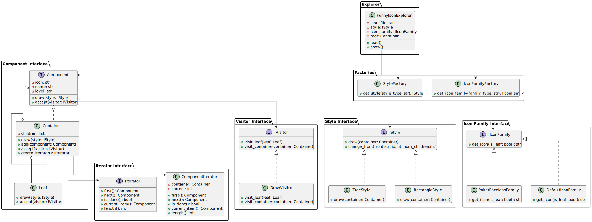
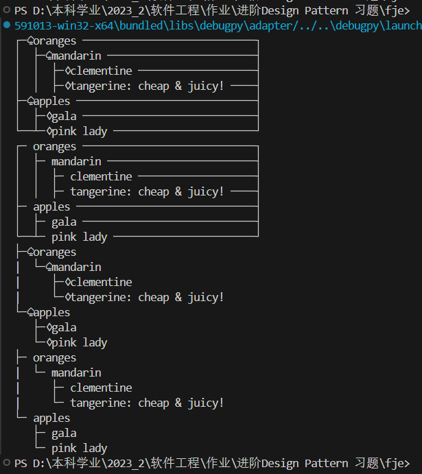
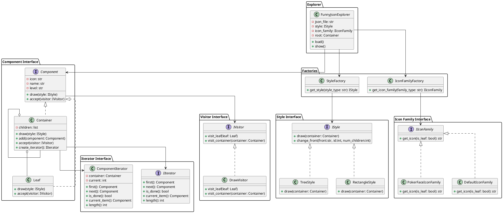

# FJE 进阶作业

bizt

## 一、实验要求

对已有FJE实现进行设计重构

1. 改用迭代器 +访问者模式，或者 迭代器 +策略模式(根据所用语言和技术栈恰当选定)

## 二、程序设计

在本次实验中，我使用了迭代器 +访问者模式对原程序进行改写。设计结果如下:

### 2.1 类图



#### Style Interface 包

该包定义了样式接口及其实现类，用于绘制容器。

- **IStyle 接口**：

  - `+draw(container: Container)`：绘制容器的方法。
  - `+change_front(front: str, id: int, num_children: int)`：更改前缀的方法。
- **TreeStyle 类**：

  - 实现 `IStyle` 接口，用树形样式绘制容器。
  - `+draw(container: Container)`：具体实现树形样式的绘制方法。
- **RectangleStyle 类**：

  - 实现 `IStyle` 接口，用矩形样式绘制容器。
  - `+draw(container: Container)`：具体实现矩形样式的绘制方法。

#### Icon Family Interface 包

该包定义了图标系列接口及其实现类，用于获取节点的图标。

- **IIconFamily 接口**：

  - `+get_icon(is_leaf: bool): str`：根据是否为叶子节点获取图标。
- **PokerFaceIconFamily 类**：

  - 实现 `IIconFamily` 接口，获取扑克脸图标。
  - `+get_icon(is_leaf: bool): str`：具体实现扑克脸图标的获取方法。
- **DefaultIconFamily 类**：

  - 实现 `IIconFamily` 接口，获取默认图标。
  - `+get_icon(is_leaf: bool): str`：具体实现默认图标的获取方法。

#### Component Interface 包

该包定义了组件接口及其实现类，用于表示容器和叶子节点。

- **Component 接口**：

  - `-icon: str`：组件的图标。
  - `-name: str`：组件的名称。
  - `-level: str`：组件的层级。
  - `+draw(style: IStyle)`：绘制组件的方法。
  - `+accept(visitor: IVisitor)`：接受访问者的方法。
- **Container 类**：

  - 继承 `Component` 接口，表示容器节点。
  - `-children: list`：子组件列表。
  - `+draw(style: IStyle)`：具体实现容器节点的绘制方法。
  - `+add(component: Component)`：添加子组件的方法。
  - `+accept(visitor: IVisitor)`：具体实现接受访问者的方法。
  - `+create_iterator(): IIterator`：创建迭代器的方法。
- **Leaf 类**：

  - 继承 `Component` 接口，表示叶子节点。
  - `+draw(style: IStyle)`：具体实现叶子节点的绘制方法。
  - `+accept(visitor: IVisitor)`：具体实现接受访问者的方法。

#### Iterator Interface 包

该包定义了迭代器接口及其实现类，用于遍历容器的子组件。

- **IIterator 接口**：

  - `+first(): Component`：返回第一个组件。
  - `+next(): Component`：返回下一个组件。
  - `+is_done(): bool`：判断遍历是否完成。
  - `+current_item(): Component`：返回当前组件。
  - `+length(): int`: 返回迭代长度。
- **ComponentIterator 类**：

  - 实现 `IIterator` 接口，遍历容器的子组件。
  - `-container: Container`：要遍历的容器。
  - `-current: int`：当前遍历的索引。
  - `+first(): Component`：具体实现返回第一个组件的方法。
  - `+next(): Component`：具体实现返回下一个组件的方法。
  - `+is_done(): bool`：具体实现判断遍历是否完成的方法。
  - `+current_item(): Component`：具体实现返回当前组件的方法。
  - `+length(): int`: 具体实现返回迭代长度的方法。

#### Visitor Interface 包

该包定义了访问者接口及其实现类，用于访问组件并执行操作。

- **IVisitor 接口**：

  - `+visit_leaf(leaf: Leaf)`：访问叶子节点的方法。
  - `+visit_container(container: Container)`：访问容器节点的方法。
- **DrawVisitor 类**：

  - 实现 `IVisitor` 接口，用于绘制组件。
  - `+visit_leaf(leaf: Leaf)`：具体实现访问叶子节点的方法。
  - `+visit_container(container: Container)`：具体实现访问容器节点的方法。

#### Factories 包

该包定义了工厂类，用于创建样式和图标系列对象。

- **StyleFactory 类**：

  - `+get_style(style_type: str): IStyle`：根据样式类型获取样式对象。
- **IconFamilyFactory 类**：

  - `+get_icon_family(family_type: str): IIconFamily`：根据图标系列类型获取图标系列对象。

#### Explorer 包

该包定义了 FunnyJsonExplorer 类，用于加载和显示 JSON 数据。

- **FunnyJsonExplorer 类**：
  - `-json_file: str`：JSON 文件路径。
  - `-style: IStyle`：样式对象。
  - `-icon_family: IIconFamily`：图标系列对象。
  - `-root: Container`：根容器。
  - `+load()`：加载 JSON 数据的方法。
  - `+show()`：显示数据的方法。

#### 类之间的关系

- `IStyle` 接口由 `TreeStyle` 和 `RectangleStyle` 类实现。
- `IIconFamily` 接口由 `PokerFaceIconFamily` 和 `DefaultIconFamily` 类实现。
- `Component` 接口由 `Leaf` 和 `Container` 类实现。
- `Container` 类包含 `Leaf` 和其他 `Container` 类的子组件。
- `IIterator` 接口由 `ComponentIterator` 类实现。
- `IVisitor` 接口由 `DrawVisitor` 类实现。
- `Component` 接口包含 `IVisitor` 接口，以支持访问者模式。
- `StyleFactory` 类返回实现 `IStyle` 接口的对象。
- `IconFamilyFactory` 类返回实现 `IIconFamily` 接口的对象。
- `FunnyJsonExplorer` 类使用 `StyleFactory` 和 `IconFamilyFactory` 创建的对象，并操作 `Component` 对象。

### 2.2 设计模式及作用

#### 2.2.1 迭代器模式 (Iterator Pattern)

迭代器模式提供了一种方法顺序访问一个聚合对象中的各个元素，而不暴露其内部表示。迭代器模式包含以下几个部分：

1. **迭代器接口** (`IIterator`)：定义遍历元素的方法。
2. **具体迭代器** (`ComponentIterator`)：实现迭代器接口，维护遍历状态。
3. **聚合对象接口** ：定义一个方法来创建迭代器对象。
4. **具体聚合对象** (`Container`)：实现创建迭代器的方法。

为了使用迭代器模式，在本次实验中，我做了以下更改：

- 定义 `IIterator` 接口，包含 `first`, `next`, `is_done`, `current_item` 等方法。
- 实现 `ComponentIterator` 类，遍历 `Container` 的子组件。
- 在 `Container` 类中添加 `create_iterator` 方法，返回 `ComponentIterator` 对象。

```python
# fje/components/iterator.py
class IIterator(ABC):
    @abstractmethod
    def first(self):
        pass

    @abstractmethod
    def next(self):
        pass

    @abstractmethod
    def is_done(self):
        pass

    @abstractmethod
    def current_item(self):
        pass
  
    @abstractmethod
    def length(self):
        pass

class ComponentIterator(IIterator):
    def __init__(self, container):
        self._container = container
        self._index = 0

    def first(self):
        return self._container.children[0] if self._container.children else None

    def next(self):
        self._index += 1
        if self._index < self.length():
            return self._container.children[self._index]
        return None

    def is_done(self):
        return self._index >= self.length()

    def current_item(self):
        if self._index < self.length():
            return self._container.children[self._index]
        return None
    def length(self):
        return len(self._container.children)

# fje/components/container.py
class Container(Component):

    def create_iterator(self):
        from .iterator import ComponentIterator
        return ComponentIterator(self)
```

#### 2.2.2 访问者模式 (Visitor Pattern)

访问者模式将作用于某种数据结构中的各元素的操作分离出来封装成独立的类，使得增加新的操作变得非常容易。访问者模式包含以下几个部分：

1. **访问者接口** (`IVisitor`)：定义访问不同类型元素的方法。
2. **具体访问者** (`DrawVisitor`)：实现访问者接口，定义每个元素的具体操作。
3. **元素接口** (`Component`)：定义一个接受访问者的方法。
4. **具体元素** (`Leaf` 和 `Container`)：实现接受访问者的方法。

为了实现访问者模式，在本次实验中，我做了以下更改：

- 定义 `IVisitor` 接口，包含 `visit_leaf` 和 `visit_container` 方法。
- 实现 `DrawVisitor` 类，定义访问 `Leaf` 和 `Container` 的具体操作。
- 在 `Component` 接口中添加 `accept` 方法。
- 在 `Leaf` 和 `Container` 类中实现 `accept` 方法，调用访问者的相应方法。

```python
# fje/visitor/visitor.py
class IVisitor(ABC):
    @abstractmethod
    def visit_leaf(self, leaf):
        pass

    @abstractmethod
    def visit_container(self, container):
        pass

class DrawVisitor(IVisitor):
    def __init__(self, style):
        self.style = style

    def visit_leaf(self, leaf):
        leaf.draw(self.style)

    def visit_container(self, container):
        container.draw(self.style)
        iterator = container.create_iterator()
        idx = 0
        child = iterator.first()
        while not iterator.is_done():
            child.level = self.style.change_front(
                self.style, container.level, idx, iterator.length()
            )
            child.accept(self)
            idx += 1
            child = iterator.next()

# fje/components/components.py
class Component(ABC):

    @abstractmethod
    def accept(self, visitor):
        pass

# fje/components/container.py
class Container(Component):

    def accept(self, visitor):
        visitor.visit_container(self)

# fje/components/leaf.py
class Leaf(Component):

    def accept(self, visitor):
        visitor.visit_leaf(self)
```

值得一提的是，在 `DrawVisitor`的 `visit_container`方法中，其调用迭代器对container的部件进行访问，通过让每一个子部件接受visitor来进行绘图(将绘图操作封装成了 `DrawVisitor`类,对绘图动作进行了提取)，这体现了本次实验设计的迭代器 + 访问者模式设计要求。

#### 2.2.3 作用

1. **增强代码的可扩展性** ：通过使用访问者模式，新的操作（如打印、保存、统计等）可以被添加到对象结构中，而不需要修改这些对象的类。通过使用迭代器模式，不同的遍历方式可以独立于对象结构实现。
2. **提高代码的可维护性** ：将遍历逻辑从对象结构中分离出来，增强了代码的单一职责，使得代码更加简洁和易于理解。
3. **促进代码重用** ：通过使用迭代器和访问者模式，通用的遍历和操作逻辑可以被复用，从而减少代码的重复。

## 三、程序测试

### 3.1 标准测试

运行fje/data/sample.json



```txt
┌─♤oranges ────────────────────────────┐
│  ├─♤mandarin ────────────────────────┤
│  │  ├─♢clementine ───────────────────┤
│  │  ├─♢tangerine: cheap & juicy! ────┤
├─♤apples ─────────────────────────────┤
│  ├─♢gala ────────────────────────────┤
└──┴─♢pink lady ───────────────────────┘
┌─ oranges ────────────────────────────┐
│  ├─ mandarin ────────────────────────┤
│  │  ├─ clementine ───────────────────┤
│  │  ├─ tangerine: cheap & juicy! ────┤
├─ apples ─────────────────────────────┤
│  ├─ gala ────────────────────────────┤
└──┴─ pink lady ───────────────────────┘
├─♤oranges
|  └─♤mandarin
|     ├─♢clementine
|     └─♢tangerine: cheap & juicy!
└─♤apples
   ├─♢gala
   └─♢pink lady
├─ oranges
|  └─ mandarin
|     ├─ clementine
|     └─ tangerine: cheap & juicy!
└─ apples
   ├─ gala
   └─ pink lady
```

### 3.2 进阶测试

运行fje/data/test_data.json

```txt
└─ company
   ├─ name: Tech Enterprises
   ├─ location
   |  ├─ city: Tech City
   |  ├─ country: Techland
   |  └─ coordinates
   |     ├─ latitude: 37.7749
   |     └─ longitude: -122.4194
   ├─ employees
   |  ├─ John Doe
   |  |  ├─ name: John Doe
   |  |  ├─ age: 30
   |  |  ├─ position: Software Engineer
   |  |  ├─ skills: ['Python', 'JavaScript', 'SQL']
   |  |  └─ projects
   |  |     ├─ Project X
   |  |     |  ├─ name: Project X
   |  |     |  ├─ description: Developing new features
   |  |     |  └─ status: In Progress
   |  |     └─ Project Y
   |  |        ├─ name: Project Y
   |  |        ├─ description: Bug fixing and optimization
   |  |        └─ status: Completed
   |  └─ Alice Smith
   |     ├─ name: Alice Smith
   |     ├─ age: 28
   |     ├─ position: Data Scientist
   |     ├─ skills: ['R', 'Python', 'Machine Learning']
   |     └─ projects
   |        ├─ Data Analysis
   |        |  ├─ name: Data Analysis
   |        |  ├─ description: Analyzing customer data
   |        |  └─ status: Completed
   |        └─ Predictive Modeling
   |           ├─ name: Predictive Modeling
   |           ├─ description: Building predictive models
   |           └─ status: In Progress
   └─ departments
      ├─ engineering: ['Software', 'Hardware']
      └─ data_science: ['Analytics', 'Machine Learning']
└─♤company
   ├─♢name: Tech Enterprises
   ├─♤location
   |  ├─♢city: Tech City
   |  ├─♢country: Techland
   |  └─♤coordinates
   |     ├─♢latitude: 37.7749
   |     └─♢longitude: -122.4194
   ├─♤employees
   |  ├─♤John Doe
   |  |  ├─♢name: John Doe
   |  |  ├─♢age: 30
   |  |  ├─♢position: Software Engineer
   |  |  ├─♢skills: ['Python', 'JavaScript', 'SQL']
   |  |  └─♤projects
   |  |     ├─♤Project X
   |  |     |  ├─♢name: Project X
   |  |     |  ├─♢description: Developing new features
   |  |     |  └─♢status: In Progress
   |  |     └─♤Project Y
   |  |        ├─♢name: Project Y
   |  |        ├─♢description: Bug fixing and optimization
   |  |        └─♢status: Completed
   |  └─♤Alice Smith
   |     ├─♢name: Alice Smith
   |     ├─♢age: 28
   |     ├─♢position: Data Scientist
   |     ├─♢skills: ['R', 'Python', 'Machine Learning']
   |     └─♤projects
   |        ├─♤Data Analysis
   |        |  ├─♢name: Data Analysis
   |        |  ├─♢description: Analyzing customer data
   |        |  └─♢status: Completed
   |        └─♤Predictive Modeling
   |           ├─♢name: Predictive Modeling
   |           ├─♢description: Building predictive models
   |           └─♢status: In Progress
   └─♤departments
      ├─♢engineering: ['Software', 'Hardware']
      └─♢data_science: ['Analytics', 'Machine Learning']
┌─ company ─────────────────────────────────────────────────────┐
│  ├─ name: Tech Enterprises ───────────────────────────────────┤
│  ├─ location ─────────────────────────────────────────────────┤
│  │  ├─ city: Tech City ───────────────────────────────────────┤
│  │  ├─ country: Techland ─────────────────────────────────────┤
│  │  ├─ coordinates ───────────────────────────────────────────┤
│  │  │  ├─ latitude: 37.7749 ──────────────────────────────────┤
│  │  │  ├─ longitude: -122.4194 ───────────────────────────────┤
│  ├─ employees ────────────────────────────────────────────────┤
│  │  ├─ John Doe ──────────────────────────────────────────────┤
│  │  │  ├─ name: John Doe ─────────────────────────────────────┤
│  │  │  ├─ age: 30 ────────────────────────────────────────────┤
│  │  │  ├─ position: Software Engineer ────────────────────────┤
│  │  │  ├─ skills: ['Python', 'JavaScript', 'SQL'] ────────────┤
│  │  │  ├─ projects ───────────────────────────────────────────┤
│  │  │  │  ├─ Project X ───────────────────────────────────────┤
│  │  │  │  │  ├─ name: Project X ──────────────────────────────┤
│  │  │  │  │  ├─ description: Developing new features ─────────┤
│  │  │  │  │  ├─ status: In Progress ──────────────────────────┤
│  │  │  │  ├─ Project Y ───────────────────────────────────────┤
│  │  │  │  │  ├─ name: Project Y ──────────────────────────────┤
│  │  │  │  │  ├─ description: Bug fixing and optimization ─────┤
│  │  │  │  │  ├─ status: Completed ────────────────────────────┤
│  │  ├─ Alice Smith ───────────────────────────────────────────┤
│  │  │  ├─ name: Alice Smith ──────────────────────────────────┤
│  │  │  ├─ age: 28 ────────────────────────────────────────────┤
│  │  │  ├─ position: Data Scientist ───────────────────────────┤
│  │  │  ├─ skills: ['R', 'Python', 'Machine Learning'] ────────┤
│  │  │  ├─ projects ───────────────────────────────────────────┤
│  │  │  │  ├─ Data Analysis ───────────────────────────────────┤
│  │  │  │  │  ├─ name: Data Analysis ──────────────────────────┤
│  │  │  │  │  ├─ description: Analyzing customer data ─────────┤
│  │  │  │  │  ├─ status: Completed ────────────────────────────┤
│  │  │  │  ├─ Predictive Modeling ─────────────────────────────┤
│  │  │  │  │  ├─ name: Predictive Modeling ────────────────────┤
│  │  │  │  │  ├─ description: Building predictive models ──────┤
│  │  │  │  │  ├─ status: In Progress ──────────────────────────┤
│  ├─ departments ──────────────────────────────────────────────┤
│  │  ├─ engineering: ['Software', 'Hardware'] ─────────────────┤
└──┴──┴─ data_science: ['Analytics', 'Machine Learning'] ───────┘
┌─♤company ─────────────────────────────────────────────────────┐
│  ├─♢name: Tech Enterprises ───────────────────────────────────┤
│  ├─♤location ─────────────────────────────────────────────────┤
│  │  ├─♢city: Tech City ───────────────────────────────────────┤
│  │  ├─♢country: Techland ─────────────────────────────────────┤
│  │  ├─♤coordinates ───────────────────────────────────────────┤
│  │  │  ├─♢latitude: 37.7749 ──────────────────────────────────┤
│  │  │  ├─♢longitude: -122.4194 ───────────────────────────────┤
│  ├─♤employees ────────────────────────────────────────────────┤
│  │  ├─♤John Doe ──────────────────────────────────────────────┤
│  │  │  ├─♢name: John Doe ─────────────────────────────────────┤
│  │  │  ├─♢age: 30 ────────────────────────────────────────────┤
│  │  │  ├─♢position: Software Engineer ────────────────────────┤
│  │  │  ├─♢skills: ['Python', 'JavaScript', 'SQL'] ────────────┤
│  │  │  ├─♤projects ───────────────────────────────────────────┤
│  │  │  │  ├─♤Project X ───────────────────────────────────────┤
│  │  │  │  │  ├─♢name: Project X ──────────────────────────────┤
│  │  │  │  │  ├─♢description: Developing new features ─────────┤
│  │  │  │  │  ├─♢status: In Progress ──────────────────────────┤
│  │  │  │  ├─♤Project Y ───────────────────────────────────────┤
│  │  │  │  │  ├─♢name: Project Y ──────────────────────────────┤
│  │  │  │  │  ├─♢description: Bug fixing and optimization ─────┤
│  │  │  │  │  ├─♢status: Completed ────────────────────────────┤
│  │  ├─♤Alice Smith ───────────────────────────────────────────┤
│  │  │  ├─♢name: Alice Smith ──────────────────────────────────┤
│  │  │  ├─♢age: 28 ────────────────────────────────────────────┤
│  │  │  ├─♢position: Data Scientist ───────────────────────────┤
│  │  │  ├─♢skills: ['R', 'Python', 'Machine Learning'] ────────┤
│  │  │  ├─♤projects ───────────────────────────────────────────┤
│  │  │  │  ├─♤Data Analysis ───────────────────────────────────┤
│  │  │  │  │  ├─♢name: Data Analysis ──────────────────────────┤
│  │  │  │  │  ├─♢description: Analyzing customer data ─────────┤
│  │  │  │  │  ├─♢status: Completed ────────────────────────────┤
│  │  │  │  ├─♤Predictive Modeling ─────────────────────────────┤
│  │  │  │  │  ├─♢name: Predictive Modeling ────────────────────┤
│  │  │  │  │  ├─♢description: Building predictive models ──────┤
│  │  │  │  │  ├─♢status: In Progress ──────────────────────────┤
│  ├─♤departments ──────────────────────────────────────────────┤
│  │  ├─♢engineering: ['Software', 'Hardware'] ─────────────────┤
└──┴──┴─♢data_science: ['Analytics', 'Machine Learning'] ───────┘
```

## 四、附录

### 4.1 类图代码

可使用plantuml进行查看。


